# Ticket Booking System

A backend-focused ticket booking platform designed around **concurrent seat reservation, transactional booking workflows, distributed locking, role-based access control, and payment processing**.

The system uses **Angular** for the client application, **FastAPI** for the REST API, **PostgreSQL** for transactional persistence, **Redis** for distributed seat locking and temporary reservation expiry, and **Razorpay** for payment processing.

> **Engineering focus:** preventing double-booking under concurrent requests while maintaining a clean separation between API, business logic, persistence, and infrastructure concerns.

---

## Highlights

* RESTful backend built with **FastAPI**
* Angular-based customer and administration interfaces
* PostgreSQL persistence using **SQLAlchemy**
* Database schema versioning with **Alembic**
* **Redis-based distributed seat locking**
* TTL-based temporary seat reservations
* Automatic expiry of abandoned pending bookings
* Transactional booking workflow
* Prevention of concurrent double-booking
* Role-based access control for `USER` and `ADMIN`
* JWT-based authentication
* Argon2 password hashing
* Razorpay payment integration
* Dockerized backend infrastructure
* Repository/service architecture
* Automated backend tests
* Dedicated concurrency/load-testing scripts
* Swagger/OpenAPI documentation through FastAPI
* Deployed and validated on Azure

---

## Architecture

```text
                         ┌──────────────────────┐
                         │      Angular UI      │
                         │                      │
                         │  Customer / Admin    │
                         └──────────┬───────────┘
                                    │
                                    │ HTTP / JSON
                                    ▼
                         ┌──────────────────────┐
                         │      FastAPI API     │
                         │                      │
                         │ Routes / Auth / RBAC │
                         └──────────┬───────────┘
                                    │
                                    ▼
                         ┌──────────────────────┐
                         │   Service Layer      │
                         │                      │
                         │ Booking / Payment /  │
                         │ Event / User Logic   │
                         └──────────┬───────────┘
                                    │
                         ┌──────────┴───────────┐
                         │                      │
                         ▼                      ▼
                ┌─────────────────┐    ┌─────────────────┐
                │ Repository      │    │ Redis           │
                │ Layer           │    │                 │
                │                 │    │ Distributed     │
                │ SQLAlchemy      │    │ Seat Locks      │
                └────────┬────────┘    │ TTL             │
                         │             └─────────────────┘
                         ▼
                ┌─────────────────┐
                │ PostgreSQL      │
                │                 │
                │ Users           │
                │ Events          │
                │ Venues          │
                │ Seats           │
                │ Bookings        │
                │ Payments        │
                └─────────────────┘

                         ┌─────────────────┐
                         │    Razorpay     │
                         │                 │
                         │ Payment Gateway │
                         └─────────────────┘
```

---

## Core Booking Flow

The booking workflow is designed around temporary seat reservation rather than immediately treating a selected seat as permanently booked.

```text
User selects seats
       │
       ▼
Create booking
       │
       ▼
Acquire Redis seat locks
       │
       ├── Lock unavailable ──► Reject request (409)
       │
       ▼
Create PENDING booking
       │
       ▼
Set reservation expiry
       │
       ▼
Create payment order
       │
       ▼
User completes payment
       │
       ├── Payment succeeds ──► CONFIRMED
       │
       ├── Payment fails ─────► PAYMENT_FAILED
       │
       └── Timeout/expiry ───► CANCELLED
```

---

## Concurrent Seat Booking

The most important engineering problem in the system is preventing two users from successfully reserving the same seat at the same time.

A database-only check can become vulnerable when multiple requests reach the booking logic concurrently.

This system uses **Redis as a distributed locking layer**.

### Lock strategy

Each event-seat combination receives a Redis key:

```text
seat_lock:{event_id}:{seat_id}
```

The lock is acquired using an atomic Redis operation with:

```text
NX + TTL
```

The TTL prevents abandoned locks from remaining indefinitely.

Current reservation lock duration:

```text
300 seconds
```

### Lock lifecycle

```text
Request
   │
   ▼
Attempt Redis lock
   │
   ├── Already locked ──► 409 Conflict
   │
   ▼
Create PENDING booking
   │
   ▼
Payment
   │
   ├── Success ──► Confirm booking
   │
   └── Failure/expiry ──► Release reservation
```

### Safe lock release

Locks are not blindly deleted.

The release operation verifies that the Redis lock belongs to the corresponding booking before deleting it.

This prevents one request from accidentally releasing another request's lock.

---

## Concurrency Testing

The repository includes dedicated scripts for testing concurrent booking behavior.

### Same-seat contention

A load test was executed with:

```text
Requests: 100
Target:   Same event + same seat
```

Observed result:

```text
Successful requests : 1
Conflicts           : 99
Server errors       : 0
```

One recorded run achieved approximately:

```text
Requests/sec : 54.42
Avg latency  : 1647 ms
```

The important result is not the raw throughput. The important correctness property is:

> **100 concurrent attempts for the same seat resulted in exactly one successful reservation and no server errors.**

### Multiple-seat concurrency

A second test targeted 50 different seats concurrently:

```text
Requests: 50
Unique seats: 50
```

Observed result:

```text
Successful requests : 50
Errors              : 0
```

Recorded throughput:

```text
~25.77 requests/sec
```

These measurements were obtained in the local development/test environment and should not be interpreted as production capacity benchmarks.

---

## Booking Expiry

Pending bookings have an explicit expiration timestamp:

```text
bookings.expires_at
```

When the reservation expires:

1. The booking is marked `CANCELLED`.
2. Associated booking seats are marked inactive.
3. The seats become available for future bookings.
4. Redis locks are allowed to expire or are explicitly released where appropriate.

The repository also filters active reservations based on booking status and expiration time.

This prevents an abandoned checkout session from permanently consuming inventory.

---

## Payment Processing

The application integrates with **Razorpay** for payment processing.

The payment workflow is separated from the booking record.

### Payment lifecycle

```text
Booking created
      │
      ▼
Razorpay order created
      │
      ▼
Payment initiated
      │
      ├── Success ──► Payment SUCCESS
      │                 │
      │                 ▼
      │              Booking CONFIRMED
      │
      └── Failure ──► Payment FAILED
```

Payment records maintain gateway-specific identifiers such as:

* Razorpay order ID
* Razorpay payment ID
* Payment amount
* Currency
* Payment status
* Timestamps

Razorpay credentials are provided through environment variables and are never committed to the repository.

---

## Authentication & Authorization

The backend implements authentication and role-based authorization.

### Authentication

* JWT access tokens
* Password hashing with Argon2
* Active/inactive user state
* Protected API endpoints

### Roles

| Role    | Access                                                                     |
| ------- | -------------------------------------------------------------------------- |
| `GUEST` | Browse events, select seats, view event and venue details (cannot book)    |
| `USER`  | Browse events, select seats, create bookings, make payments, view bookings |
| `ADMIN` | Manage events, venues, bookings, users and administrative operations       |

Administrative endpoints are protected separately from normal user operations.

---

## Data Model

The core domain is modeled around users, events, venues, seats, bookings and payments.

```text
User
 │
 └── Booking
       │
       ├── BookingSeat ─── Seat ─── Venue
       │
       └── Payment

Event
 │
 └── EventVenue ─── Venue
```

An event can be associated with multiple venues, and a venue can host multiple events.

Seat identity is scoped by the physical venue.

Therefore, the same label can legitimately exist in different venues:

```text
Venue A → Seat A1
Venue B → Seat A1
```

These are different physical seats with different database identities.

This prevents a booking in one venue from incorrectly affecting an identically labelled seat in another venue.

---

## Technology Stack

| Layer               | Technology               |
| ------------------- | ------------------------ |
| Frontend            | Angular                  |
| Backend             | FastAPI                  |
| Language            | Python / TypeScript      |
| ORM                 | SQLAlchemy               |
| Database            | PostgreSQL               |
| Migrations          | Alembic                  |
| Cache / Locking     | Redis                    |
| Authentication      | JWT                      |
| Password Hashing    | Argon2                   |
| Payments            | Razorpay                 |
| API Documentation   | OpenAPI / Swagger        |
| Containerization    | Docker                   |
| Testing             | Pytest                   |
| Concurrency Testing | Python load-test scripts |
| Cloud               | Azure                    |

---

## Project Structure

```text
Ticket-Booking-System/
│
├── backend/
│   ├── alembic/
│   ├── app/
│   │   ├── api/
│   │   │   ├── routes/
│   │   │   └── deps.py
│   │   ├── models/
│   │   ├── schemas/
│   │   ├── repositories/
│   │   ├── services/
│   │   └── ...
│   ├── tests/
│   ├── concurrency_test.py
│   ├── alembic.ini
│   ├── Dockerfile
│   └── requirements.txt
│
├── frontend/
│   ├── src/
│   ├── public/
│   ├── angular.json
│   ├── package.json
│   └── package-lock.json
│
├── docs/
│   ├── architecture.md
│   ├── concurrency.md
│   └── database.md
│
├── concurrency_load_test.py
├── docker-compose.yml
├── .env.example
├── .gitignore
└── README.md
```

---

## Local Development

### Prerequisites

Install the following:

* Python 3.11+
* Node.js 18+
* npm
* PostgreSQL
* Redis
* Docker Desktop
* Git

Razorpay test credentials are required only for testing the payment workflow.

---

## Environment Configuration

Create a local environment file:

```text
backend/.env
```

Use the provided example as a template:

```text
backend/.env.example
```

Never commit the real `.env` file.

Typical configuration includes:

```env
DATABASE_URL=...
SECRET_KEY=...
REDIS_URL=...
RAZORPAY_KEY_ID=...
RAZORPAY_KEY_SECRET=...
```

---

## Backend Setup

Navigate to the backend:

```bash
cd backend
```

Create a virtual environment:

```bash
python -m venv .venv
```

Activate it on Windows:

```cmd
.venv\Scripts\activate
```

Install dependencies:

```bash
pip install -r requirements.txt
```

Run database migrations:

```bash
alembic upgrade head
```

Start the API:

```bash
uvicorn app.main:app --reload
```

The API will be available at:

```text
http://localhost:8000
```

Interactive API documentation:

```text
http://localhost:8000/docs
```

---

## Frontend Setup

Navigate to the frontend:

```bash
cd frontend
```

Install dependencies:

```bash
npm install
```

Start Angular:

```bash
ng serve
```

The frontend will be available at the Angular development server address shown in the terminal.

---

## Docker

The backend infrastructure can also be run using Docker.

Build and start services:

```bash
docker compose up --build
```

Stop services:

```bash
docker compose down
```

For local development, environment variables should still be supplied through the appropriate environment configuration rather than committed credentials.

---

## Database Migrations

Alembic is used for schema versioning.

Create a migration:

```bash
alembic revision --autogenerate -m "describe change"
```

Apply migrations:

```bash
alembic upgrade head
```

Rollback the latest migration:

```bash
alembic downgrade -1
```

Database schema changes should be committed together with their corresponding migration files.

---

## Testing

Run backend tests with:

```bash
pytest
```

For concurrency testing:

```bash
python concurrency_test.py
```

or use the dedicated load-test script:

```bash
python concurrency_load_test.py
```

Concurrency tests should be executed against a test environment and should not be pointed at a production database.

---

## API Documentation

FastAPI automatically exposes OpenAPI documentation.

After starting the backend:

```text
Swagger UI
http://localhost:8000/docs
```

The API includes endpoints covering:

* Authentication
* Users
* Events
* Venues
* Seats
* Bookings
* Payments
* Administrative operations

---

## Engineering Decisions

### Why Redis for seat locking?

PostgreSQL remains the source of truth for persistent booking state, while Redis provides a fast distributed coordination mechanism for short-lived seat reservations.

This separation allows the system to distinguish between:

```text
Persistent state
      ↓
PostgreSQL

Temporary distributed lock
      ↓
Redis
```

### Why TTL-based locks?

A user may abandon a checkout session.

Without expiration, a temporary reservation could remain indefinitely.

TTL provides an automatic recovery mechanism.

### Why a service/repository architecture?

The application separates:

```text
HTTP concerns
     ↓
Routes

Business rules
     ↓
Services

Persistence
     ↓
Repositories

Database
     ↓
PostgreSQL
```

This reduces coupling and makes business logic easier to test and evolve.

---

## Security Considerations

The repository intentionally excludes secrets and generated environment files.

Sensitive configuration includes:

* Database credentials
* JWT signing secrets
* Razorpay credentials
* Redis configuration

These values must be supplied through environment configuration.

Passwords are never stored in plaintext and are hashed using Argon2.

Administrative operations require appropriate authorization.

---

## Azure Deployment

The application was deployed to a temporary cloud validation environment to verify the system end-to-end outside the local Docker development environment.

### Azure Resources

- Azure Static Web Apps for the Angular frontend
- Azure Container Apps for the FastAPI backend
- Azure Database for PostgreSQL Flexible Server for transactional persistence
- Upstash Redis for distributed seat locking
- Azure Container Registry for Docker image storage

### Deployment Validation

- FastAPI health endpoint returned `{"status":"ok"}`.
- Container App revision `ticket-booking-api--0000007` was running successfully.
- Azure PostgreSQL reached Alembic head `3cf201acbc29`.
- Redis connectivity from inside the running Container App returned `True`.
- Angular frontend successfully communicated with the deployed API.

### Azure Infrastructure Screenshots

#### Azure Database

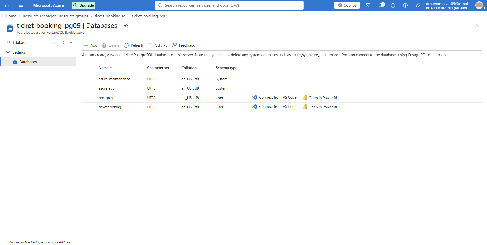

#### Azure Container App

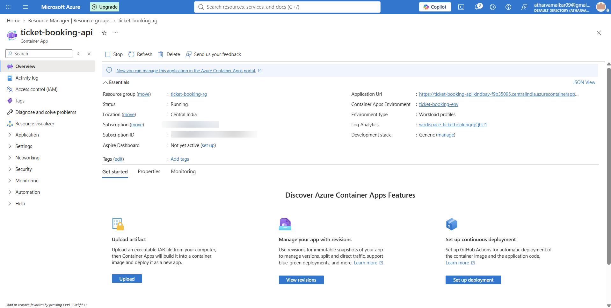

#### Azure PostgreSQL Flexible Server

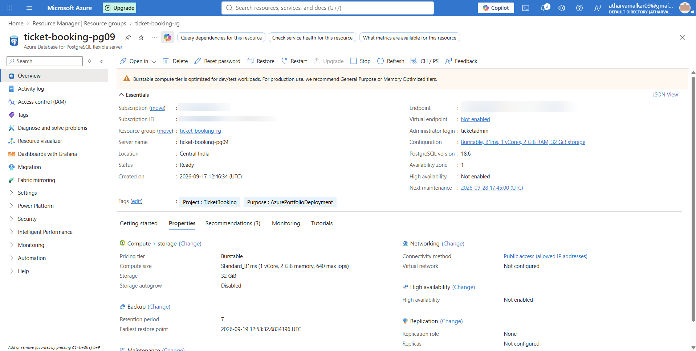

#### Azure Repositories

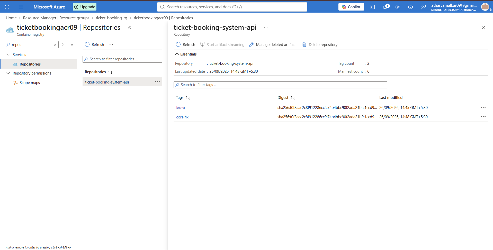

#### Azure Container Registry

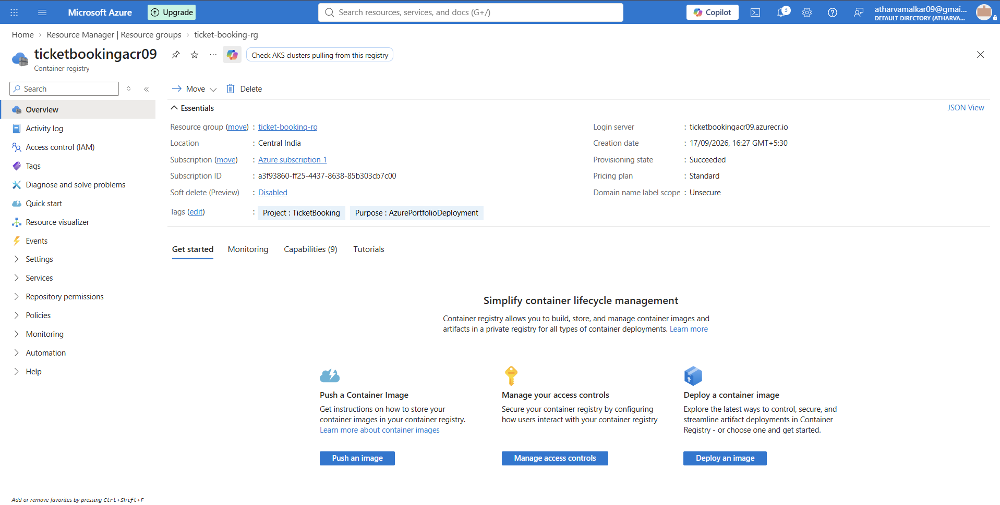

#### Upstash Redis

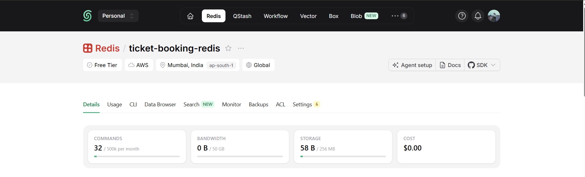


### Public Demo

Frontend: https://mango-wave-02a8ef100-preview.eastasia.2.azurestaticapps.net/

API: https://ticket-booking-api.kindbay-f9b35095.centralindia.azurecontainerapps.io

The cloud environment is intended for temporary portfolio demonstration and validation rather than production-scale operation.

### Application Screenshots

#### Home Page

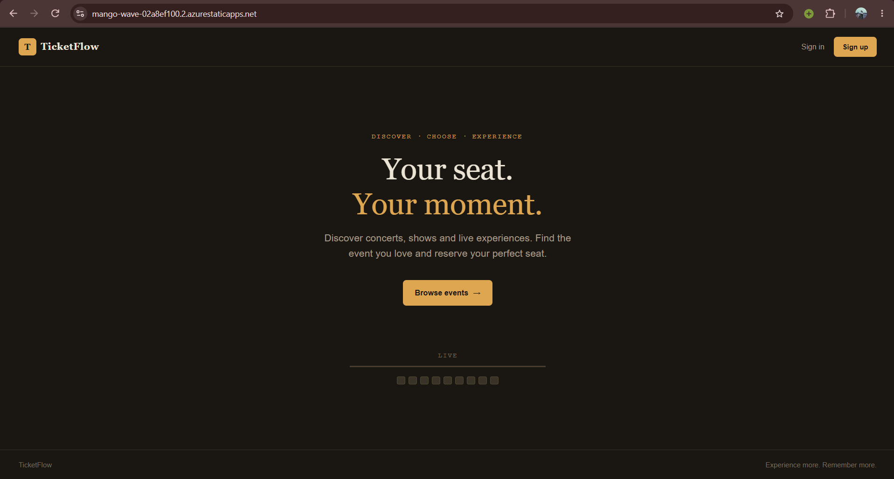

#### Events Page

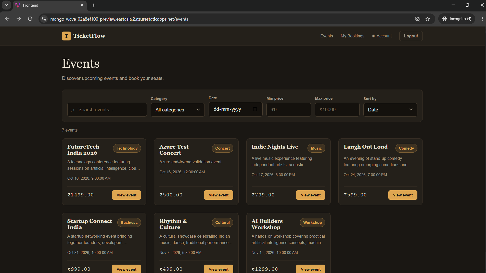

#### Event Details

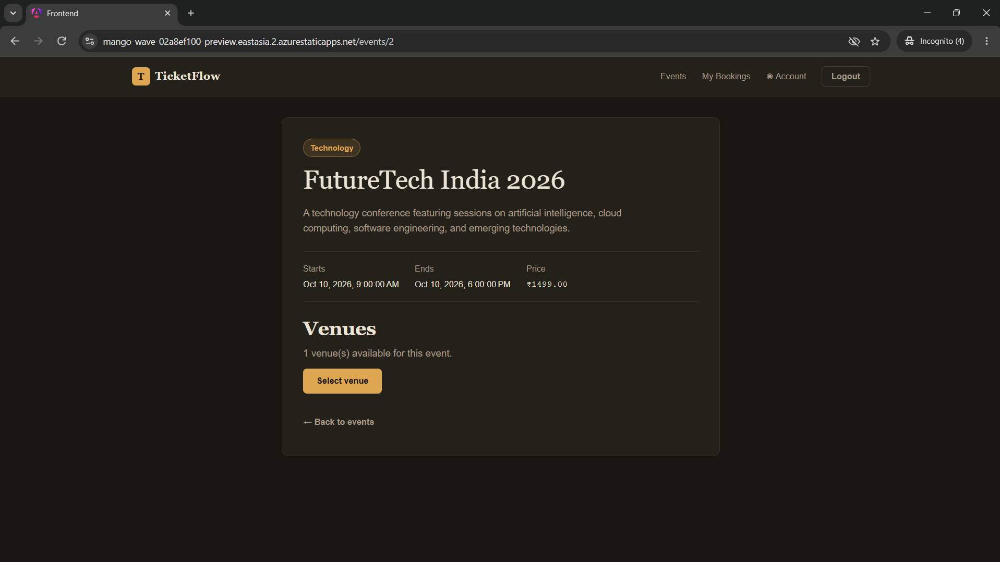

#### Seat Selection

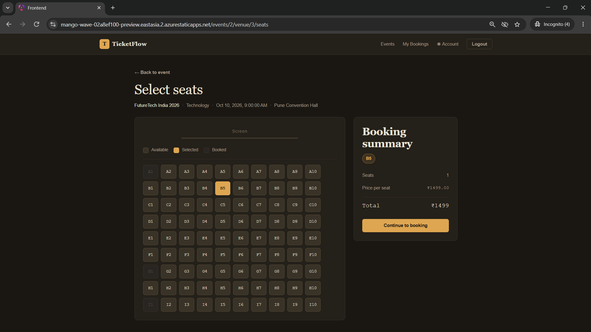

#### My Bookings

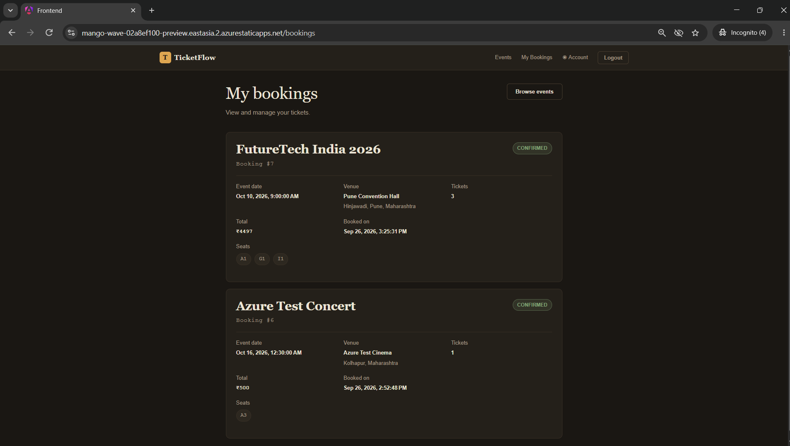

#### Admin Dashboard

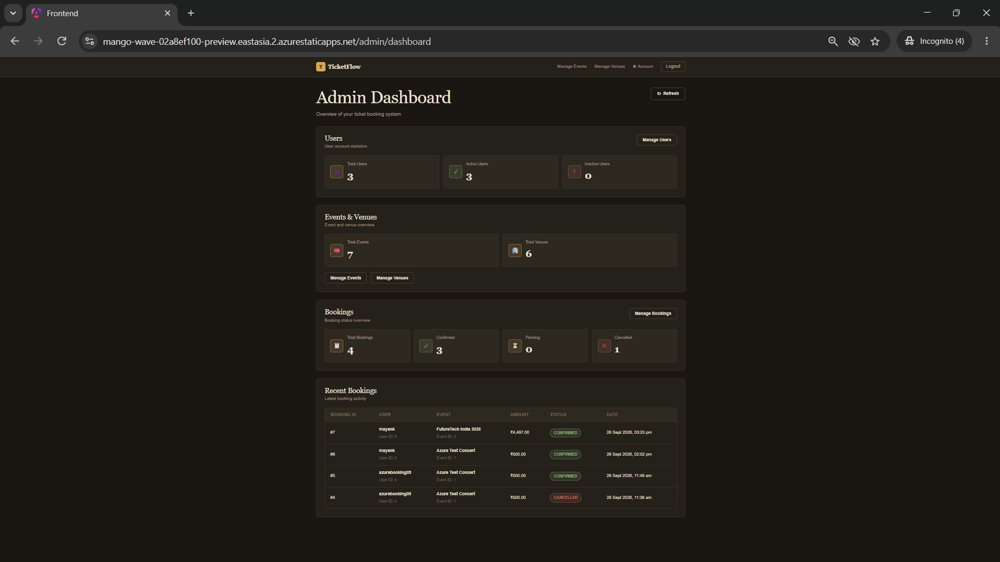

#### Swagger API

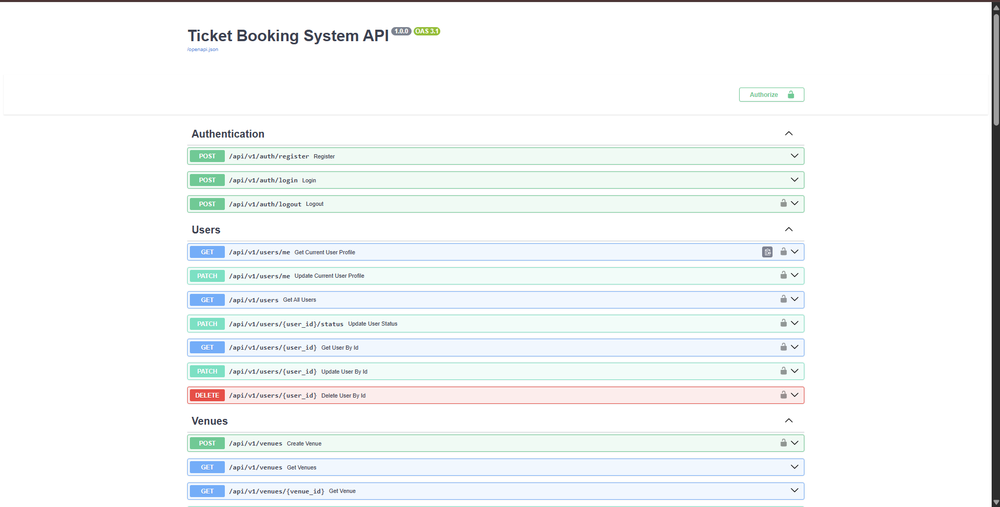

---

## Azure Concurrency Validation

The deployed Azure API was tested with 100 concurrent booking requests targeting the same event and seat.

| Metric | Result |
|---|---:|
| Concurrent requests | 100 |
| Successful bookings | 1 |
| Conflicts | 99 |
| Other errors | 0 |
| Total time | 5.381 sec |
| Throughput | 18.58 req/s |
| Average latency | 2063.12 ms |
| P50 latency | 1456.76 ms |
| P95 latency | 5020.83 ms |
| P99 latency | 5337.11 ms |

The result matched the expected concurrency behavior: one request successfully booked the seat while the remaining 99 requests were rejected as conflicts.

---

## Deployment Troubleshooting and Failure Evidence

The Azure deployment required several debugging steps before the final environment was validated.

### PostgreSQL Firewall Timeout

The API initially could not connect to Azure PostgreSQL because the required client IP was not allowed by the PostgreSQL firewall. The firewall configuration was corrected and connectivity was revalidated.

### Alembic Migration Issues

The Azure database initially lacked the required bookings schema. Migration inconsistencies were encountered and repaired, including enum/index conflicts and a duplicate price column definition.

### Container Apps to PostgreSQL Connectivity

Initial connectivity attempts between Azure Container Apps and PostgreSQL resulted in connection timeouts. Azure networking, firewall rules, database configuration, and application connection settings were checked before connectivity was successfully established.

### Frontend API Configuration

The Angular production configuration initially contained incorrectly quoted API URL template expressions in multiple services. These were corrected and the affected services were rebuilt.

### CORS Configuration

After deployment, browser requests from the Azure Static Web Apps frontend required explicit CORS configuration on the FastAPI backend. The production and preview frontend origins were added, the API image was rebuilt, and the Container App was redeployed.

### Final Validation

After these fixes:

- The production frontend loaded successfully.
- Frontend API requests completed successfully.
- API health returned `{"status":"ok"}`.
- Redis connectivity from the running Container App returned `True`.
- Concurrent same-seat validation produced 1 successful booking and 99 conflicts.

---

## Known Limitations

This project is designed as a production-oriented engineering project, but it is **not presented as a production-scale ticketing platform**.

Current limitations include:

* Payment processing uses Razorpay test mode.
* Local concurrency benchmarks are not production capacity benchmarks.
* No distributed tracing/observability stack is currently included.
* No message broker/event streaming layer is currently required.
* Horizontal scaling and multi-region deployment have not been implemented.
* Automated CI/CD deployment pipelines are not currently included.

These limitations are intentional scope boundaries rather than claims of production readiness.

---

## Future Improvements

Potential next-stage improvements include:

* Redis-backed distributed rate limiting
* Background job processing for booking expiry
* Payment webhook verification
* Idempotency keys for payment and booking APIs
* Structured application logging
* Prometheus/Grafana metrics
* Distributed tracing
* CI/CD with automated testing
* Container image publishing
* Horizontal API scaling
* Database connection-pool tuning
* Integration and end-to-end test suites
* Automated API contract testing

---

## Project Status

- Azure cloud deployment completed for portfolio validation
- End-to-end frontend -> API -> PostgreSQL -> Redis flow validated
- Concurrent seat-booking protection validated with 100 simultaneous requests: 1 success, 99 conflicts, 0 unexpected errors

**Status:** Functional / portfolio-ready engineering project

Implemented areas include:

* Authentication and authorization
* Event and venue management
* Seat inventory
* Booking lifecycle
* Redis seat locking
* Reservation expiry
* Payment integration
* Administrative workflows
* Concurrent booking tests
* Docker-based development
* Azure cloud deployment and validation

---

## License

This project is available for educational and portfolio purposes.

If you intend to reuse or distribute the code, add an explicit open-source license appropriate to your intended usage.
